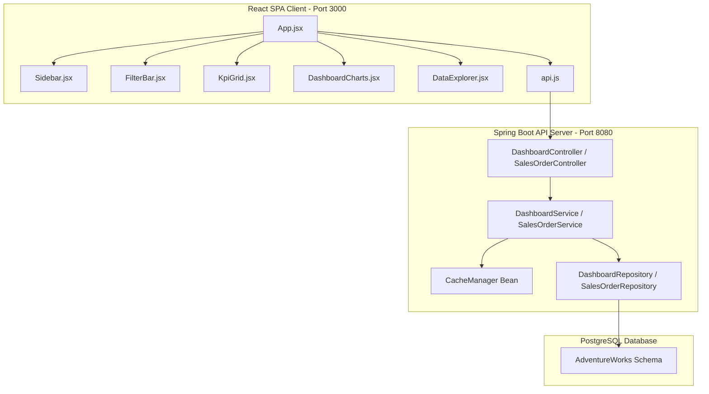

# Development Journal - AWN Dashboards Implementation

This document serves as a complete history and reference of the work done to build the AWN Dashboards backend enhancements and React analytics frontend.

---

## 1. System Architecture



---

## 2. Backend Enhancements

### A. Dynamic Caching & Entry Point Configuration
In `AwnDashboardsApplication.java`, we registered a `ConcurrentMapCacheManager` bean to handle in-memory KPI caching:
```java
package com.awn.awndashboards;

import org.springframework.boot.SpringApplication;
import org.springframework.boot.autoconfigure.SpringBootApplication;
import org.springframework.cache.CacheManager;
import org.springframework.cache.annotation.EnableCaching;
import org.springframework.cache.concurrent.ConcurrentMapCacheManager;
import org.springframework.context.annotation.Bean;

@SpringBootApplication
@EnableCaching
public class AwnDashboardsApplication {

    public static void main(String[] args) {
        SpringApplication.run(AwnDashboardsApplication.class, args);
    }

    @Bean
    public CacheManager cacheManager() {
        return new ConcurrentMapCacheManager("dashboardKpis");
    }
}
```

### B. Interactive Cross-Filtering Queries
In `DashboardRepository.java`, SQL queries were modified to support optional parameters using `cast(:param as type) IS NULL` checks:
```java
package com.awn.awndashboards.dashboard.repository;

import com.awn.awndashboards.dashboard.projection.DashboardKpiProjection;
import com.awn.awndashboards.product.entity.Product;
import org.springframework.data.jpa.repository.*;
import org.springframework.data.repository.query.Param;
import org.springframework.stereotype.Repository;

import java.time.LocalDateTime;
import java.util.List;

@Repository
public interface DashboardRepository extends JpaRepository<Product,Integer>{

    @Query(value="""
        SELECT
            COALESCE(SUM(sod.linetotal), 0) totalRevenue,
            COUNT(DISTINCT soh.salesorderid) totalOrders,
            COUNT(DISTINCT soh.customerid) totalCustomers,
            COUNT(DISTINCT sod.productid) totalProducts
        FROM sales.salesorderheader soh
        JOIN sales.salesorderdetail sod ON soh.salesorderid = sod.salesorderid
        JOIN production.product p ON sod.productid = p.productid
        LEFT JOIN production.productsubcategory psc ON p.productsubcategoryid = psc.productsubcategoryid
        LEFT JOIN production.productcategory pc ON psc.productcategoryid = pc.productcategoryid
        WHERE (cast(:startDate as timestamp) IS NULL OR soh.orderdate >= cast(:startDate as timestamp))
          AND (cast(:endDate as timestamp) IS NULL OR soh.orderdate <= cast(:endDate as timestamp))
          AND (cast(:territoryId as integer) IS NULL OR soh.territoryid = cast(:territoryId as integer))
          AND (cast(:categoryName as varchar) IS NULL OR pc.name = cast(:categoryName as varchar))
        """, nativeQuery=true)
    DashboardKpiProjection getDashboardKpis(
            @Param("startDate") LocalDateTime startDate,
            @Param("endDate") LocalDateTime endDate,
            @Param("territoryId") Integer territoryId,
            @Param("categoryName") String categoryName);

    // ... additional queries (MonthlySales, SalesByCategory, TopProducts, etc.) follow similar filter patterns.
}
```

### C. Caching Service Annotations
`DashboardServiceImpl.java` applies `@Cacheable` to KPIs dynamically matching filters:
```java
@Override
@Cacheable(value = "dashboardKpis", key = "{#startDate, #endDate, #territoryId, #categoryName}")
public DashboardKpiProjection getDashboardKpis(LocalDateTime startDate, LocalDateTime endDate, Integer territoryId, String categoryName) {
    return repository.getDashboardKpis(startDate, endDate, territoryId, categoryName);
}

@Override
@CacheEvict(value = "dashboardKpis", allEntries = true)
public void clearCache() {
    // Manually clearing cache
}
```

### D. Dynamic Pagination and Sorting
`SalesOrderController.java` was rewritten to accept page parameters and fix compiler conflicts:
```java
package com.awn.awndashboards.sales.controller;

import com.awn.awndashboards.sales.dto.SalesOrderDTO;
import com.awn.awndashboards.sales.service.SalesOrderService;
import lombok.RequiredArgsConstructor;
import org.springframework.data.domain.Page;
import org.springframework.data.domain.PageRequest;
import org.springframework.data.domain.Sort;
import org.springframework.web.bind.annotation.*;

@RestController
@RequestMapping("/api/sales-orders")
@RequiredArgsConstructor
@CrossOrigin(origins = "*")
public class SalesOrderController {

    private final SalesOrderService salesOrderService;

    @GetMapping
    public Page<SalesOrderDTO> getAllSalesOrders(
            @RequestParam(defaultValue = "0") int page,
            @RequestParam(defaultValue = "10") int size,
            @RequestParam(defaultValue = "salesOrderId") String sortBy,
            @RequestParam(defaultValue = "asc") String direction) {

        Sort sort = direction.equalsIgnoreCase("desc") ? Sort.by(sortBy).descending() : Sort.by(sortBy).ascending();
        return salesOrderService.getAllSalesOrders(PageRequest.of(page, size, sort));
    }
}
```

### E. Docker Deployment Scripts
`Dockerfile` for multi-stage building:
```dockerfile
# Stage 1: Build the application
FROM maven:3.9.6-eclipse-temurin-17 AS build
WORKDIR /app
COPY pom.xml .
COPY src ./src
RUN mvn clean package -DskipTests

# Stage 2: Run the application
FROM eclipse-temurin:17-jre-jammy
WORKDIR /app
COPY --from=build /app/target/*.jar app.jar
EXPOSE 8080
ENTRYPOINT ["java", "-jar", "app.jar"]
```

`docker-compose.yml` for orchestration:
```yaml
version: '3.8'

services:
  app:
    build:
      context: .
      dockerfile: Dockerfile
    ports:
      - "8080:8080"
    environment:
      - SPRING_DATASOURCE_URL=${SPRING_DATASOURCE_URL:-jdbc:postgresql://ep-tiny-darkness-aoev5pei.c-2.ap-southeast-1.aws.neon.tech/neondb?sslmode=require}
      - SPRING_DATASOURCE_USERNAME=${SPRING_DATASOURCE_USERNAME:-neondb_owner}
      - SPRING_DATASOURCE_PASSWORD=${SPRING_DATASOURCE_PASSWORD:-npg_flAc1Ha5mMOW}
```

---

## 3. Frontend Implementation

Created at `D:\React Projects\awn-dashboard` utilizing **Vite**, **React**, **Recharts**, and **Axios**.

### A. Dark Glassmorphism CSS Theme (`index.css`)
```css
:root {
  --bg-main: #0a0b0e;
  --bg-sidebar: #0f1118;
  --bg-card: rgba(20, 22, 33, 0.7);
  --border-color: rgba(255, 255, 255, 0.07);
  --accent-teal: #06b6d4;
  --accent-indigo: #6366f1;
  --text-primary: #f3f4f6;
  --text-secondary: #9ca3af;
}
.glass-card {
  background: var(--bg-card);
  backdrop-filter: blur(16px);
  border: 1px solid var(--border-color);
  border-radius: 12px;
}
```

### B. Interactive Filtering Component (`FilterBar.jsx`)
Features selectors for categories, territories, start/end dates, and a clear cache button:
```javascript
const FilterBar = ({ filters, setFilters, onClearCache }) => {
  // Renders dropdowns for categories and territories, converting dates to ISO LocalDateTime format before submission.
};
```

### C. Server-Side Tabular Explorer (`DataExplorer.jsx`)
Generic component for handling server-side sorting and page changes:
```javascript
const DataExplorer = ({ title, columns, fetchData, defaultSortBy }) => {
  // Manages state for pagination page, size, sorting fields, and triggers fetch requests.
};
```
