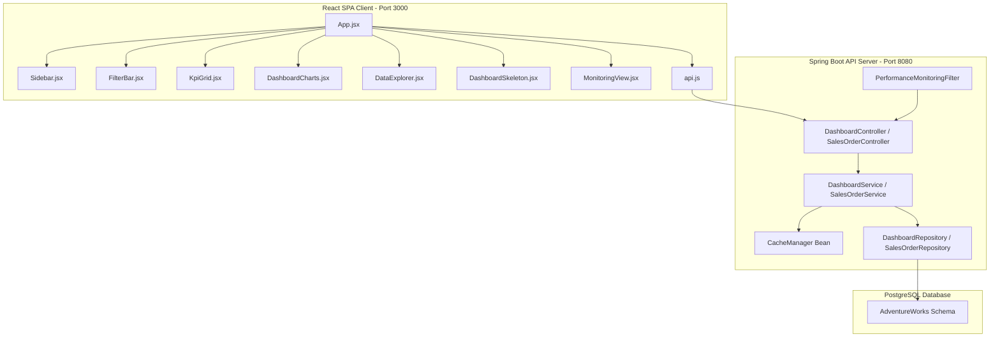

# Development Journal - AWN Dashboards Implementation

This document serves as a complete history and reference of the work done to build the AWN Dashboards backend enhancements, React analytics frontend, and God-Tier UX / Telemetry systems.

---

## 1. System Architecture



---

## 2. Backend Enhancements

### A. Dynamic Caching & Entry Point Configuration
In `AwnDashboardsApplication.java`, we registered a `ConcurrentMapCacheManager` bean to handle in-memory KPI caching:
```java
package com.awn.awndashboards;

import org.springframework.boot.SpringApplication;
import org.springframework.boot.autoconfigure.SpringBootApplication;
import org.springframework.cache.CacheManager;
import org.springframework.cache.annotation.EnableCaching;
import org.springframework.cache.concurrent.ConcurrentMapCacheManager;
import org.springframework.context.annotation.Bean;

@SpringBootApplication
@EnableCaching
public class AwnDashboardsApplication {

    public static void main(String[] args) {
        SpringApplication.run(AwnDashboardsApplication.class, args);
    }

    @Bean
    public CacheManager cacheManager() {
        return new ConcurrentMapCacheManager("dashboardKpis");
    }
}
```

### B. Interactive Cross-Filtering Queries
In `DashboardRepository.java`, SQL queries were modified to support optional parameters using `cast(:param as type) IS NULL` checks:
```java
package com.awn.awndashboards.dashboard.repository;

import com.awn.awndashboards.dashboard.projection.DashboardKpiProjection;
import com.awn.awndashboards.product.entity.Product;
import org.springframework.data.jpa.repository.*;
import org.springframework.data.repository.query.Param;
import org.springframework.stereotype.Repository;

import java.time.LocalDateTime;
import java.util.List;

@Repository
public interface DashboardRepository extends JpaRepository<Product,Integer>{

    @Query(value="""
        SELECT
            COALESCE(SUM(sod.linetotal), 0) totalRevenue,
            COUNT(DISTINCT soh.salesorderid) totalOrders,
            COUNT(DISTINCT soh.customerid) totalCustomers,
            COUNT(DISTINCT sod.productid) totalProducts
        FROM sales.salesorderheader soh
        JOIN sales.salesorderdetail sod ON soh.salesorderid = sod.salesorderid
        JOIN production.product p ON sod.productid = p.productid
        LEFT JOIN production.productsubcategory psc ON p.productsubcategoryid = psc.productsubcategoryid
        LEFT JOIN production.productcategory pc ON psc.productcategoryid = pc.productcategoryid
        WHERE (cast(:startDate as timestamp) IS NULL OR soh.orderdate >= cast(:startDate as timestamp))
          AND (cast(:endDate as timestamp) IS NULL OR soh.orderdate <= cast(:endDate as timestamp))
          AND (cast(:territoryId as integer) IS NULL OR soh.territoryid = cast(:territoryId as integer))
          AND (cast(:categoryName as varchar) IS NULL OR pc.name = cast(:categoryName as varchar))
        """, nativeQuery=true)
    DashboardKpiProjection getDashboardKpis(
            @Param("startDate") LocalDateTime startDate,
            @Param("endDate") LocalDateTime endDate,
            @Param("territoryId") Integer territoryId,
            @Param("categoryName") String categoryName);

    // ... additional queries (MonthlySales, SalesByCategory, TopProducts, etc.) follow similar filter patterns.
}
```

### C. Caching Service Annotations
`DashboardServiceImpl.java` applies `@Cacheable` to KPIs dynamically matching filters:
```java
@Override
@Cacheable(value = "dashboardKpis", key = "{#startDate, #endDate, #territoryId, #categoryName}")
public DashboardKpiProjection getDashboardKpis(LocalDateTime startDate, LocalDateTime endDate, Integer territoryId, String categoryName) {
    com.awn.awndashboards.config.PerformanceMonitoringFilter.cacheMisses.incrementAndGet();
    return repository.getDashboardKpis(startDate, endDate, territoryId, categoryName);
}

@Override
@CacheEvict(value = "dashboardKpis", allEntries = true)
public void clearCache() {
    // Manually clearing cache
}
```

### D. Performance Telemetry Filter
Tracks average latency in nanoseconds and handles cache hits/misses statistics:
```java
package com.awn.awndashboards.config;

import jakarta.servlet.*;
import jakarta.servlet.http.HttpServletRequest;
import org.springframework.stereotype.Component;
import java.io.IOException;
import java.util.concurrent.atomic.AtomicLong;

@Component
public class PerformanceMonitoringFilter implements Filter {

    public static final AtomicLong totalRequests = new AtomicLong(0);
    public static final AtomicLong totalKpiRequests = new AtomicLong(0);
    public static final AtomicLong cacheMisses = new AtomicLong(0);
    public static final AtomicLong totalLatencyNs = new AtomicLong(0);

    @Override
    public void doFilter(ServletRequest request, ServletResponse response, FilterChain chain)
            throws IOException, ServletException {
        
        HttpServletRequest httpRequest = (HttpServletRequest) request;
        String path = httpRequest.getRequestURI();

        if (path.startsWith("/api")) {
            totalRequests.incrementAndGet();
            if (path.contains("/dashboard/kpis")) {
                totalKpiRequests.incrementAndGet();
            }
            long startTime = System.nanoTime();
            try {
                chain.doFilter(request, response);
            } finally {
                long duration = System.nanoTime() - startTime;
                totalLatencyNs.addAndGet(duration);
            }
        } else {
            chain.doFilter(request, response);
        }
    }
}
```

### E. Server-Sent Events Emitter & Order Simulator
`DashboardController.java` supports streaming live order events and order transaction simulation:
```java
    @GetMapping(value = "/live-stream", produces = MediaType.TEXT_EVENT_STREAM_VALUE)
    public SseEmitter liveStream() {
        SseEmitter emitter = new SseEmitter(30 * 60 * 1000L); // 30 minutes timeout
        emitters.add(emitter);
        emitter.onCompletion(() -> emitters.remove(emitter));
        emitter.onTimeout(() -> emitters.remove(emitter));
        return emitter;
    }

    @PostMapping("/simulate-order")
    public Map<String, Object> simulateSalesOrder() {
        // ... constructs LiveOrderEvent, evicts cache, broadcasts event to emitters.
    }
```

---

## 3. Frontend Implementation

Created at `D:\React Projects\awn-dashboard` utilizing **Vite**, **React**, **Recharts**, and **Axios**.

### A. Dark Glassmorphism CSS Theme with Preset Themes (`index.css`)
```css
:root {
  --bg-main: #0a0b0e;
  --bg-sidebar: #0f1118;
  --bg-card: rgba(20, 22, 33, 0.7);
  --border-color: rgba(255, 255, 255, 0.07);
}
.theme-cyberpunk {
  --accent-teal: #00f0ff;
  --accent-indigo: #ff007f;
}
.glass-card {
  background: var(--bg-card);
  backdrop-filter: blur(16px);
  border: 1px solid var(--border-color);
  border-radius: 12px;
}
```

### B. Telemetry Monitor & Live Ticker (`MonitoringView.jsx`)
Features latency telemetry tracking, cache ratios, and live SSE orders scrollticker:
```javascript
const MonitoringView = ({ liveOrders, triggerSimulation, simLoading }) => {
  // Renders Avg Latency, Cache Hit ratios, Active SSE clients, and simulated trigger action buttons.
};
```
